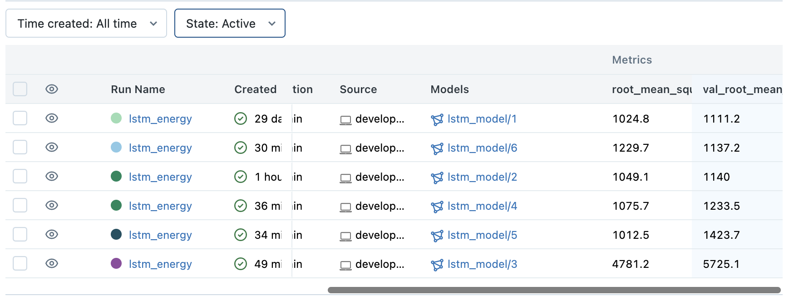
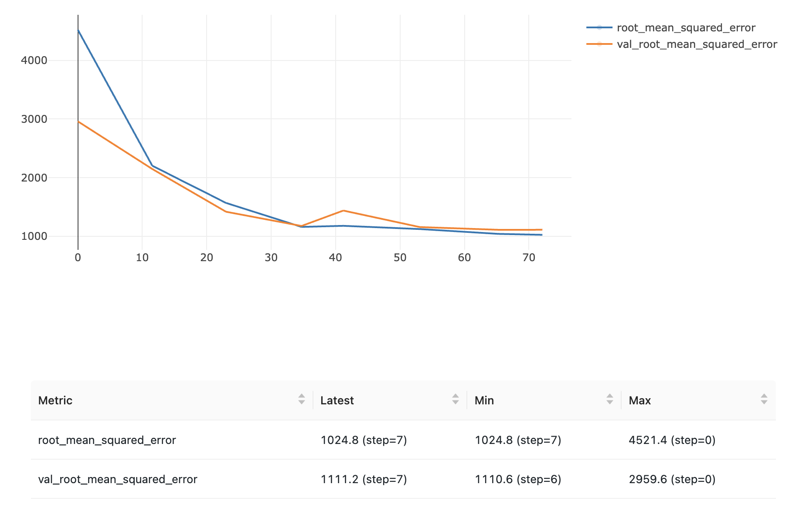
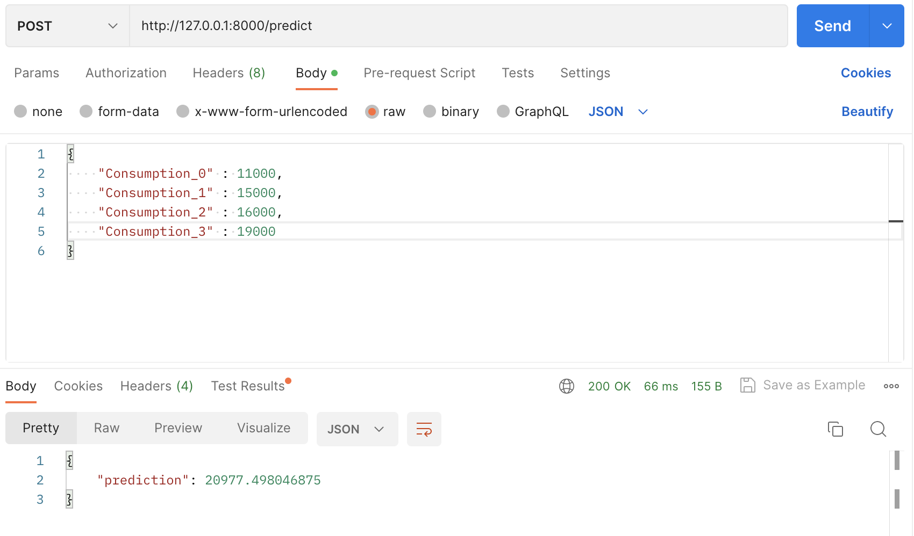

# Time Series Forecasting of Univariate Energy Consumption Project by using LSTM, Mlflow and FastAPI.

Technologies used in this project are; 
1. Keras
2. MLFlow
3. FastAPI

data source: https://seffaflik.epias.com.tr/transparency/tuketim/gerceklesen-tuketim/gercek-zamanli-tuketim.xhtml

**Here are the registered model versions;**

**Best model rmse scores;**

**JSON API Endpoint**

